[Contents](index.md)

# Webapplication

## Uploading

After logging in, the main page is displayed. It only shows a short
message and a link “New Share…” to the upload form. Then you'll get
the following screen:

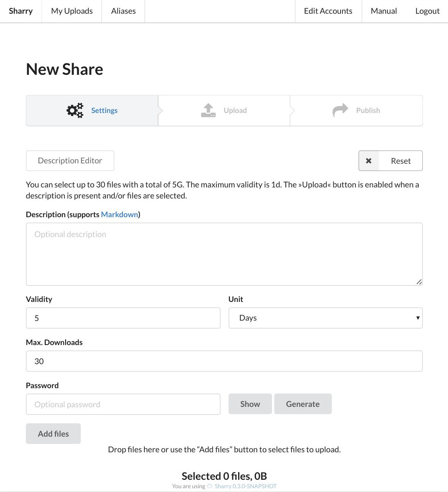

The first line shows the current and remaining state. The next button
will be enabled, once the form has all required fields filled.

Required is either a description or a selected file. If one of these
things is given, the next step “Upload” will be available.

The description field allows to add rich text using [markdown](http://daring-fireball.net). You
can see what is possible by clicking the small “Markdown” link above
the description field. This will show some syntax help, any click on
this text gets you back to the form.

The button “Description Editor” opens a editor in a single page for
the description. It is a split screen with two elements: the left is
the input for the description and on the right a preview is
rendered. You can see what your markdown looks like on the page while
you are typing.

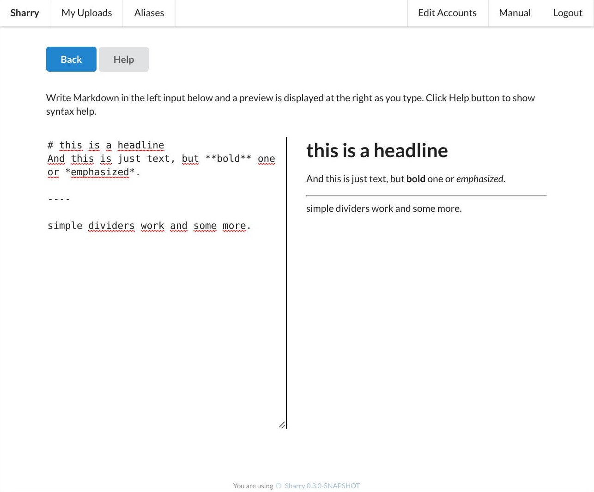

If you click “Back” you get back to the form and the description field
contains the text from the editor.

The description also allows to reference the uploaded files. It is
processed as a [mustache](http://mustache.github.io/mustache.5.html) template where certain properties, like
the url, of the files can be rendered into the description. Please
refer to the [concepts](concepts.md) page for details.

The other fields are as expected. You can set the validity time,
maximum downloads and a password. You can click “Generate” to generate
a random one. It is shown in clear text if you click on
“Show”. Finally, you can click on “Add Files” to select files to
upload. Selected files are summarized in the box below. You can also
drop files into that box to select them for upload.

If you click on “Reset” on the upper left, the form is resetted. Every
value and all files are removed.

Then if everything looks good, you can click on “Upload”. This will
first save the description and other meta data and then all files are
being uploaded.

The screen (when completed) looks like this:

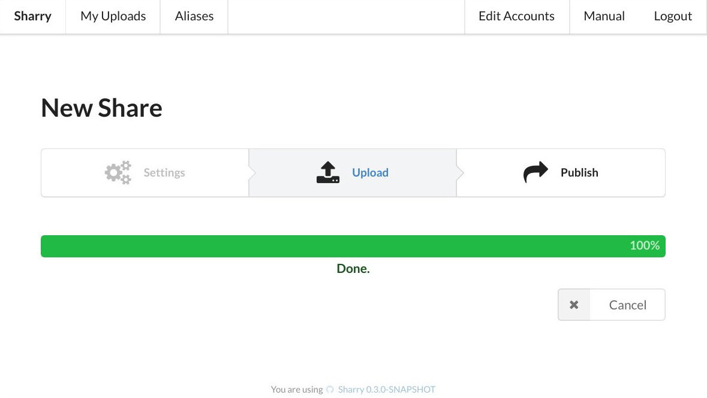

If the upload fails for some reason, it is retried automatically. You
can also click “Pause” to pause the upload and resume later. When
complete, you can choos to either publish it or cancel (or doing
nothing). Clicking “Cancel” will delete the files you just uploaded on
the server. Clicking “Publish” will publish the upload and you are
taken to the _Download page_.

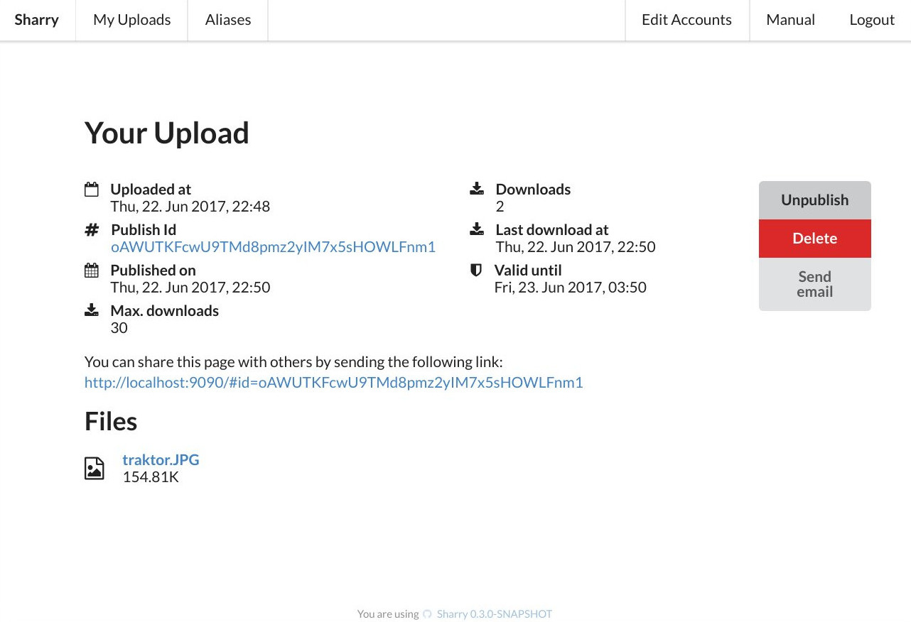

If the description has been left empty, a default headline “Your
Upload” is rendered. Then you see a summary of the upload and all its
files in a list. Clicking on a file opens/downloads it. Since you are
the owner of the upload, all the accesses won't count the “max
download” field. You'll also see a link to the “public download
page”. These pages are distinguished by id, the private download pages
uses a `uid` in the url and the public page a `id`. Both are different
ids refering to the same page. The public download page link is ment
to be shared.

You can click on “Send Email” to get to a view where a simple text
email is being prepared. You only need to add recipients, or maybe
change the mail.

You can also decide to _unpublish_ an upload. Then only you as the
owner can see it. The public download page will not work and anonymous
user cannot access the files.

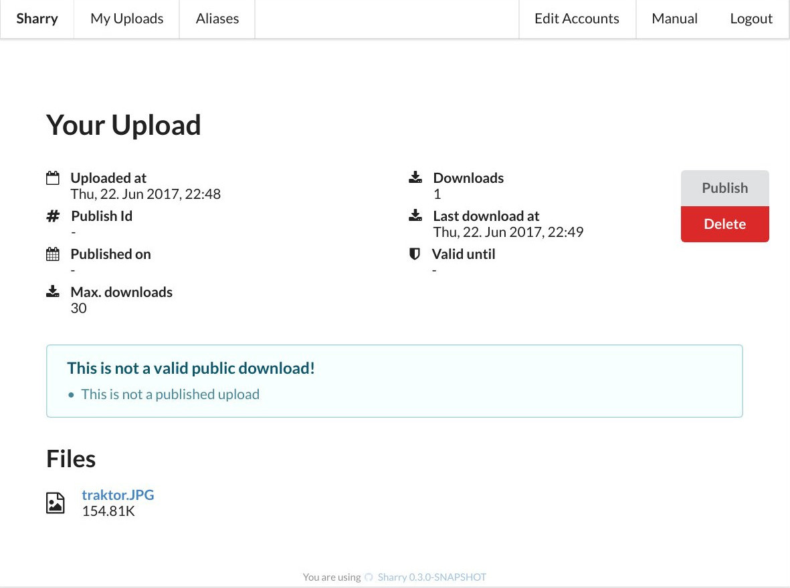

## Manage Uploads

The “Uploads” link in the top bar takes you to your list of uploads.

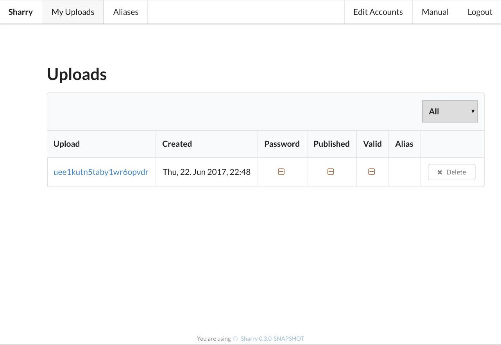

This is a simple table containing all uploads you have done and those
that were uploaded for you. They can be filtered by the dropdown
above: _incoming_ are those uploads that came in via an alias page,
while _outgoing_ means all uploads from you.

You can delete them with the “Delete” button or click on the id to get
to the _Download page_.

## Manage Aliases

The “Aliases” link in the top bar takes you to your list of aliases.

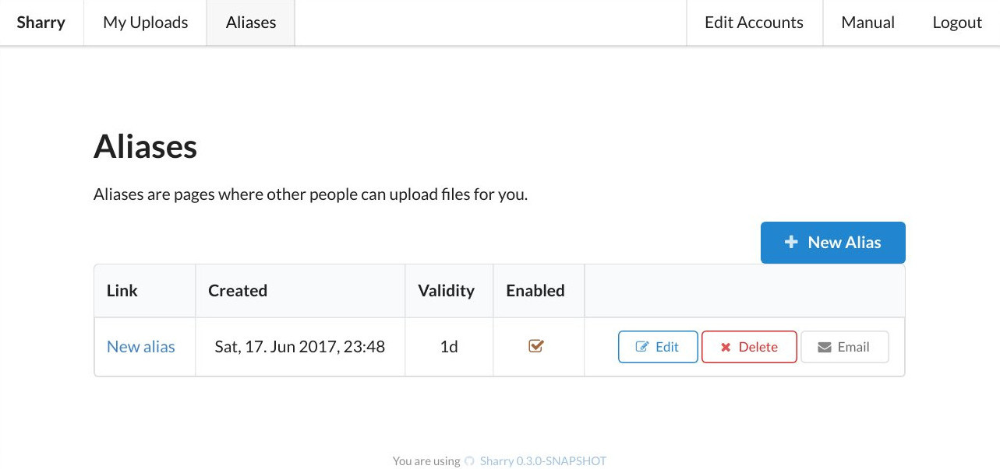

If you click on _New Alias_ a new alias is generated and added to the
table.

An alias has properties from the upload form that are added to every
upload coming from this alias. You can change them via the _Edit_
button. You can also disable an alias without deleting it.

As with uploads, the link to the alias pages are ment to be shared so
other people can send files to you. Clicking on “Email”, opens a email
form analog to the upload form so you can send this link to others.

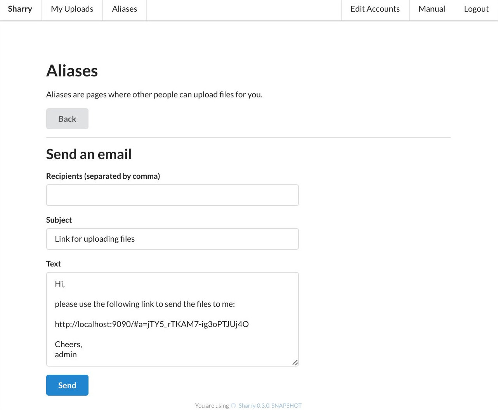

## Manage Accounts

If you are logged in as an admin user, you can manage accounts. Click
on the _Edit Accounts_ link in the navigation bar. This opens the
following page:

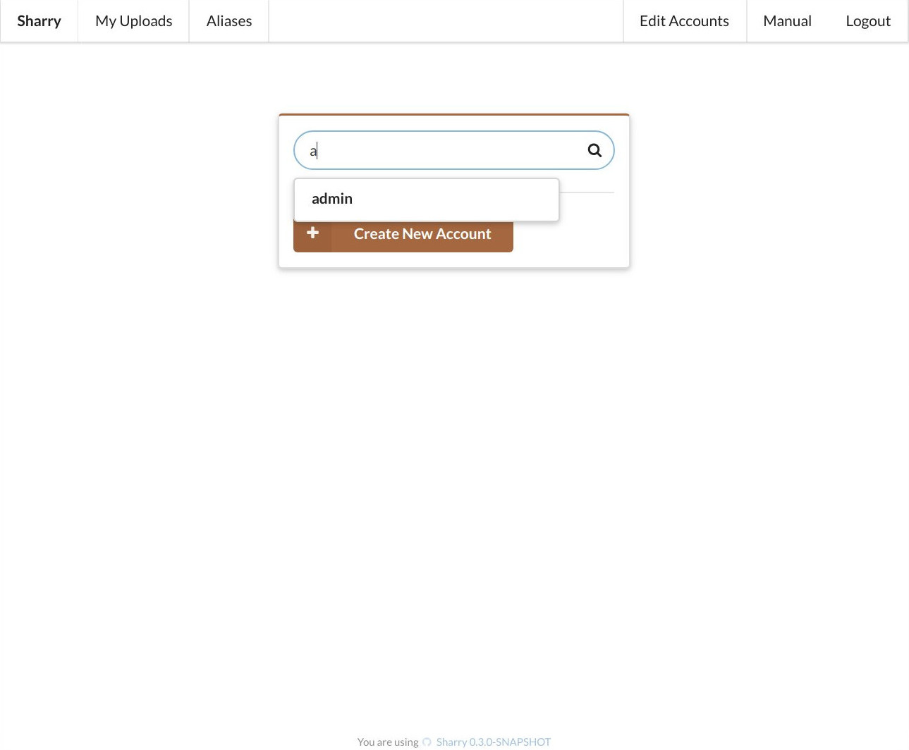

The text box allows to search for users by login. If you click on
proposed item, it is loaded into the account form and you can modify
it.

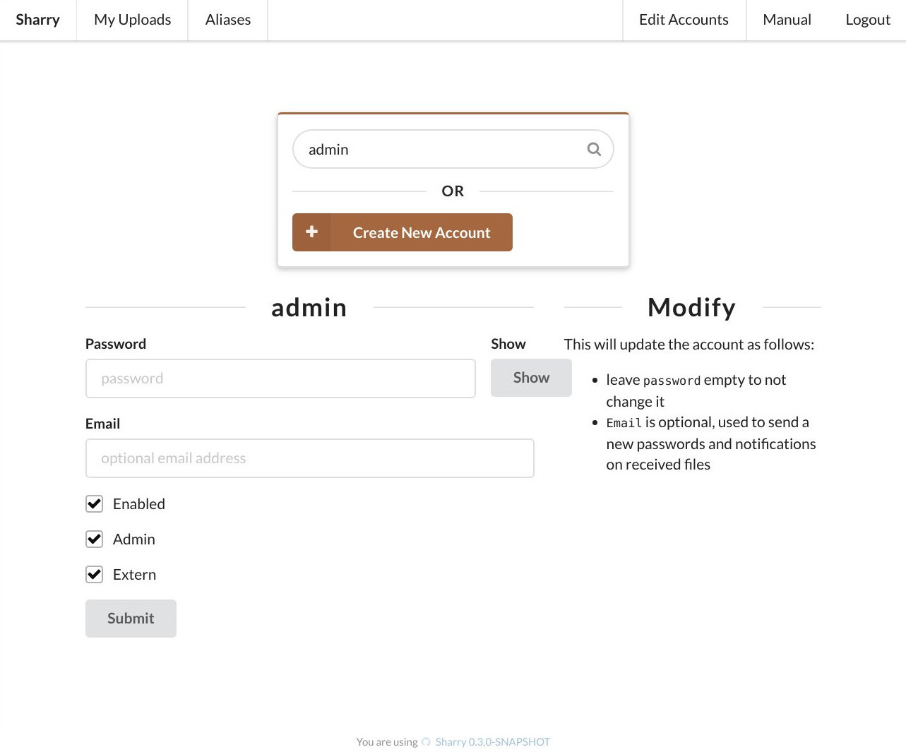

If you want to create new account, search for a login name that
doesn't exist and click on the _Create new account_ button.

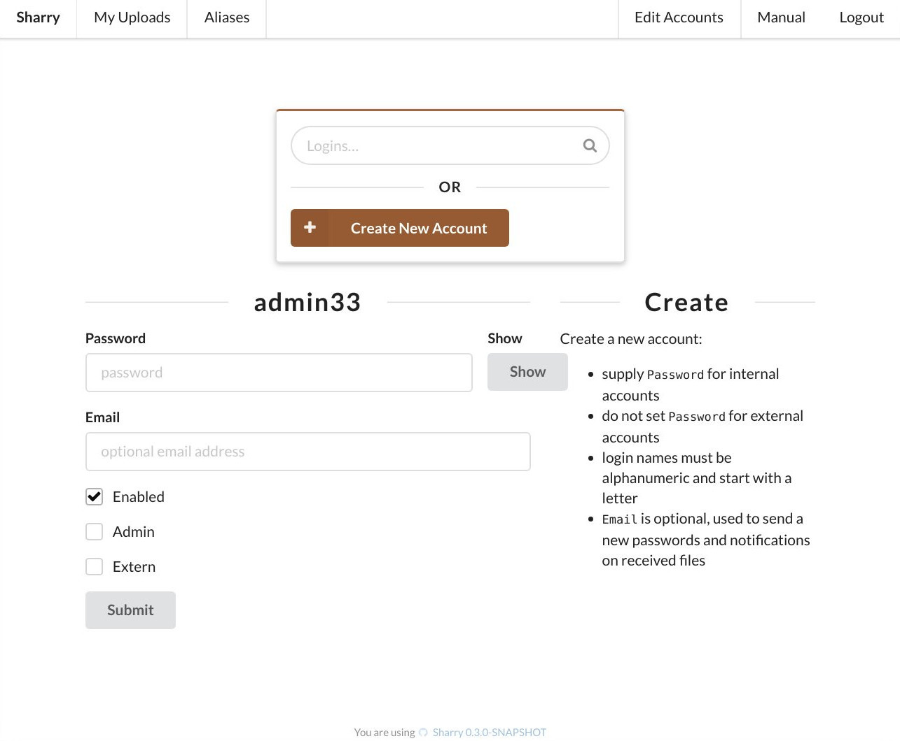

Then the same form opens and allows to add a new account.
