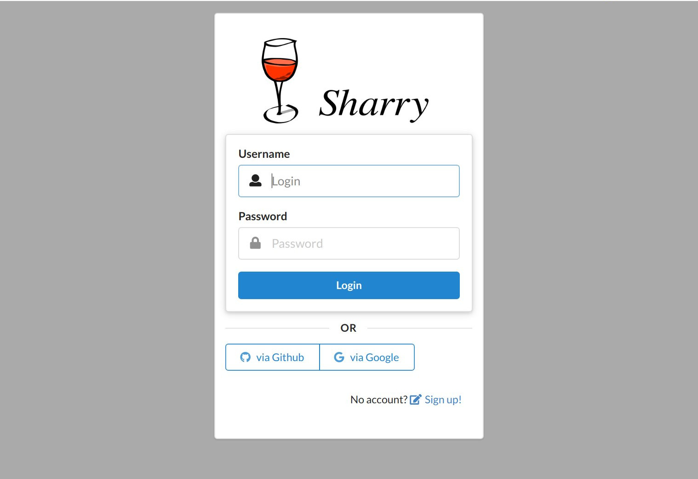

# {{ page.title }}

Sharry's executable can take one argument – a configuration file. If
that is not given, the defaults are used. The config file overrides
default values, so only values that differ from the defaults are
necessary to specify.


## File Format

The format of the configuration files can be
[HOCON](https://github.com/lightbend/config/blob/master/HOCON.md#hocon-human-optimized-config-object-notation),
JSON or whatever the used [config
library](https://github.com/lightbend/config) understands. The default
values below are in HOCON format, which is recommended, since it
allows comments and has some [advanced
features](https://github.com/lightbend/config/blob/master/README.md#features-of-hocon). Please
refer to their documentation for more on this.


## Important Config Options

The configuration for the REST server is below `sharry.restserver`.

### JDBC

This configures the connection to the database. By default, a H2
database in the current `/tmp` directory is configured. This will
create the database on demand in this directory.

The config looks like this:

```
sharry.restserver.backend.jdbc {
  url = ...
  user = ...
  password = ...
}
```

The `url` is the connection to the database. It must start with
`jdbc`, followed by name of the database. The rest is specific to the
database used: it is either a path to a file for H2 or a host/database
url for MariaDB and PostgreSQL.

When using H2, the user is `sa`, the password can be empty and the url
must include these options:

```
;MODE=PostgreSQL;DATABASE_TO_LOWER=TRUE
```

#### Examples

PostgreSQL:
```
url = "jdbc:postgresql://localhost:5432/sharrydb"
```

MariaDB:
```
url = "jdbc:mariadb://localhost:3306/sharrydb"
```

H2
```
url = "jdbc:h2:///path/to/a/file.db;MODE=PostgreSQL;DATABASE_TO_LOWER=TRUE"
```

### Bind

The host and port the http server binds to.

```
sharry.restsserver.bind {
  address = localhost
  port = 9090
}
```

By default, it binds to `localhost` and some predefined port.

### baseurl

The base url is an important setting that defines the http URL where
sharry can be reached. The REST server uses this url to create
absolute urls and to configure the authenication cookie. These URLs
are sent to the client, so they must resolve back to the sharry
server. If you see "network error" error messages in the browser, then
this setting is probably not correct.

By default it is build using the information from the `bind` setting.


```
sharry.restserver.baseurl = ...
```

#### Examples

```
sharry.restserver.baseurl = "https://sharry.example.com"
```


### registration options

This defines if and how new users can create accounts. There are 3
options:

- *closed* no new user can sign up
- *open* new users can sign up
- *invite* new users can sign up but require an invitation key


```
sharry.restserver.signup {
  mode = "open"

  # If mode == 'invite', a password must be provided to generate
  # invitation keys. It must not be empty.
  new-invite-password = ""

  # If mode == 'invite', this is the period an invitation token is
  # considered valid.
  invite-time = "3 days"
}
```

The mode `invite` is intended to open the application only to some
users. An admin user can create invitation keys and distribute them to
the desired people. While the user must be admin, it is also necessary
to provide the `new-invite-password`. The idea is that only the person
who installs sharry knows this. If it is not set (must be non-empty),
then invitation won't work. New invitation keys can be generated from
within the web application or via REST calls (using `curl`, for
example).

```
curl -X POST -H 'Sharry-Auth: {{apikey}}' -d '{"password":"blabla"}' "http://localhost:7880/api/v1/open/signup/newinvite"
```

## Authentication

The initial authentication will generate an authentication token which
is valid for some time. Subsequent calls to secured routes can use
this token. The token can be given as a normal http header or via a
cookie header.

The following options configure this token:

```
sharry.restserver.auth {
  server-secret = "hex:caffee" # or "b64:Y2FmZmVlCg=="
  session-valid = "8 minutes"
}
```

The `server-secret` is used to sign the token. If multiple REST
servers are deployed, all must share the same server secret. Otherwise
tokens from one instance are not valid on another instance. The secret
can be given as Base64 encoded string or in hex form. Use the prefix
`hex:` and `b64:`, respectively. If these prefixes are missing, the
string's utf8 bytes are used.

The `session-valid` deterimens how long a token is valid. This can be
just some minutes, the web application obtains new ones
periodically. So a rather short time is recommended.

The interval the webapp retrieves a new token can be configured, too.
It must be at least 30s below the `session-valid` time.

```
sharry.restserver.webapp {
  auth-renewal = "4 minutes"
}
```

### Login Modules

Login modules are used to initially authenticate a user given some
credentials. There are some modules that take a username/password pair
and hand it to an external service or program for verification. If
valid, sharry creates an account transparently. Then there is the
`oauth` setting which supports authentication via OAuth using “OAuth
Code Flow”.

All login modules can be enabled/disabled and have an `order` property
that defines the order the login modules are tried. The modules are
tried in the specified order until one gives a response.

#### Fixed

This is a simple login module for bootstrapping. It defines an admin
account using the supplied username and password (plain text) from the
config file.

```
fixed {
  enabled = false
  user = "admin"
  password = "admin"
  order = 10
}
```

It is disabled by default. If the given username doesn't match the
configured username this login module is skipped and the next is
tried.

#### Http

The http login module issues a http request with the username/password
pair as payload. The response status code determines valid
authentication.

```
http {
  enabled = false
  url = "http://localhost:1234/auth?user={{user}}&password={{pass}}"
  method = "POST"
  body = ""
  content-type = ""
  order = 20
}
```

If the method is `POST`, the body is sent as specified using the given
content type. The body and url are processed before as mustache
templates, where `{{user}}` and `{{pass}}` are replaced by their actual values. For other
requests than `POST`, the body is ignored.


#### Http Basic

The http-basic login module issues a http request with an
`Authorization` header against some configured url. The header uses
the [Basic](https://en.wikipedia.org/wiki/Basic_access_authentication)
scheme to transport the username/password pair.

```
http-basic {
  enabled = false
  url = "http://somehost:2345/path"
  method = "GET"
  order = 30
}
```

If the response is successful (in `2xx`), the user is authenticated.


#### Command

Allows to validate a username/password pair using some external system
command. This is the most flexible approach.

```
command {
  enabled = false
  program = [
    "/path/to/someprogram"
    "{{login}}"
    "{{pass}}"
  ]
  # the return code to consider successful verification
  success = 0
  order = 30
}
```

The return code of the command is used to determine valid
authentication. The `program` value is an array where the first item
is the path to the program and subsequent elements define its
arguments.

All arguments are processed as a mustache template and variables `{{user}}` and `{{pass}}` are
replaced by their actual values.


#### Internal

The internal login module simply authenticates against the sharry
database. If it is disabled, you should disable signup, too, because those
user won't be authenticated.


#### OAuth

There is now an option to authenticate using a external provider
supporting the OAuth “code flow”. There are two examples in the config
file for Github and Google. I tried to generalise it as much as
possible, but (it seems to me) OAuth is not really a protocol, every
provider may choose to do it little differently.

The `oauth` login module can be configured with multiple such
providers. Here is an example:

```
oauth = [
    {
       enabled = false
       id = "github"
       name = "Github"
       icon = "github"
       authorize-url = "https://github.com/login/oauth/authorize"
       token-url = "https://github.com/login/oauth/access_token"
       user-url = "https://api.github.com/user"
       user-id-key = "login"
       client-id = "<your client id>"
       client-secret = "<your client secret>"
     }
]
```

Each such entry in the array results in a button on the login screen.



Here is how it roughly works: If a user clicks this button, it reaches
a specific url in sharry. Sharry will read the corresponding config
entry and redirect to the provider adding all the necessary details.
The user then authenticates at the provider, which redirects back to
sharry – so this method only works if sharry is publicly available,
obviously. Then sharry does one more request to turn the code from the
redirect into a different code. And then it tries to get the account
name.

Let's go through the config values of one entry:

- `enabled`: allows to disable this entry without removing it from the
  file.
- `id`: the id that is used in the url behind the button on the login
  screen. It is also used to amend the account name.
- `name`: The name rendered as button text.
- `icon`: a [semantic-ui icon
  name](https://semantic-ui.com/elements/icon.html) for the button
- `authorize-url` this is the URL of the provider where sharry
  redirects to at first, attaching `client_id` and the redirect uri
  back to sharry.
- `token-url`: The url to the provdier where the response from the
  `authorize-url` can be turned into a token.
- `user-url`: The url to the provider that retrieves the user
  information given a token as obtained from `token-url`.
- `user-id-key`: Now it get's a bit hairy…. The protocol doesn't
  define (afaik) a common way how to exchange user data. So google
  does it different from github. Sharry supports JSON responses only
  and uses the value of `user-id-key` to lookup a value in that
  response structure. For example, the github response is a simple
  JSON object, where the login name is at field `login`. The path must
  evaluate to a string. This value is used for the new account inside
  sharry.
- `client-id` and `client-secret` These are provider specific values
  that you need to obtain there. With github, for example, you
  register a new "app" which generates these values.

Once sharry gets the account name, it creates a new account (if it not
exists already) using the account name from the provider amended with
`@<id>`.

I only tested this with github and google, I would appreciate any
information on how it works with other providers.


## Default Config


```

```

## Logging

By default, sharry logs to stdout. This works well, when managed by
systemd or other inits. Logging is done by
[logback](https://logback.qos.ch/). Please refer to its documentation
for how to configure logging.

If you created your logback config file, it can be added as argument
to the executable using this syntax:

```
/path/to/sharry -Dlogback.configurationFile=/path/to/your/logging-config-file
```

To get started, the default config looks like this:

``` xml
<configuration>
  <appender name="STDOUT" class="ch.qos.logback.core.ConsoleAppender">
    <withJansi>true</withJansi>

    <encoder>
      <pattern>[%thread] %highlight(%-5level) %cyan(%logger{15}) - %msg %n</pattern>
    </encoder>
  </appender>

  <logger name="sharry" level="debug" />
  <root level="INFO">
    <appender-ref ref="STDOUT" />
  </root>
</configuration>
```

The `<root level="INFO">` means, that only log statements with level
"INFO" will be printed. But the `<logger name="sharry"
level="debug">` above says, that for loggers with name "sharry"
statements from level "DEBUG" on will be printed, too.
