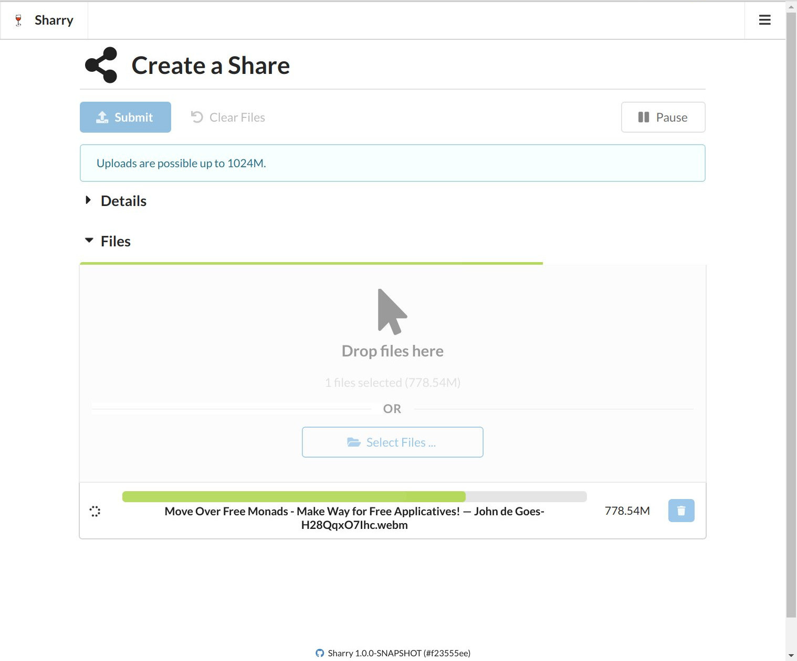
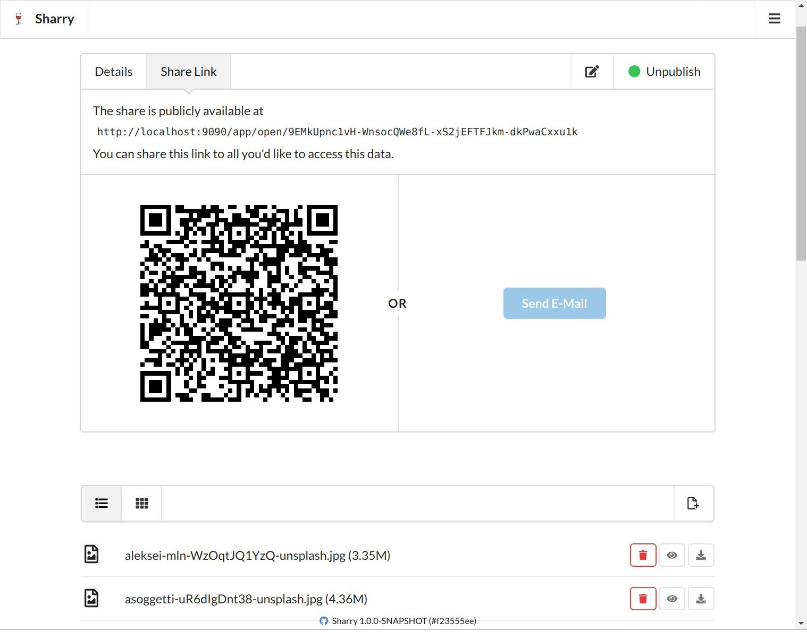
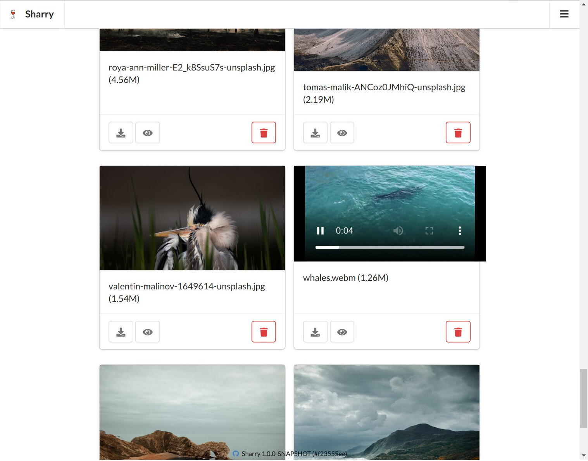
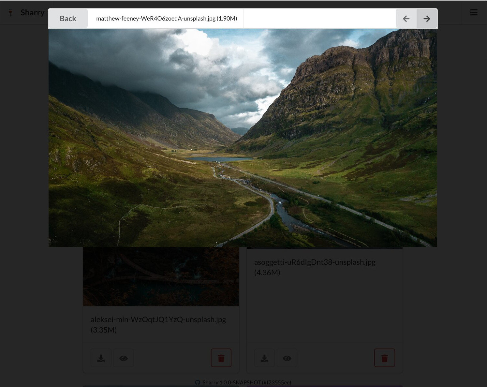

# Screenshots

These are some screenshots to get a little impression of the web
client. It might be outdated, though.

## Home Screen

## Uploading a file

## View Share Details

## View Link to public page

## View Files

## View Files with preview

## Preview a single file

