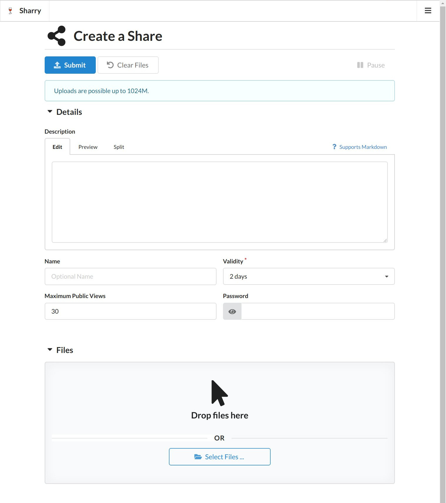
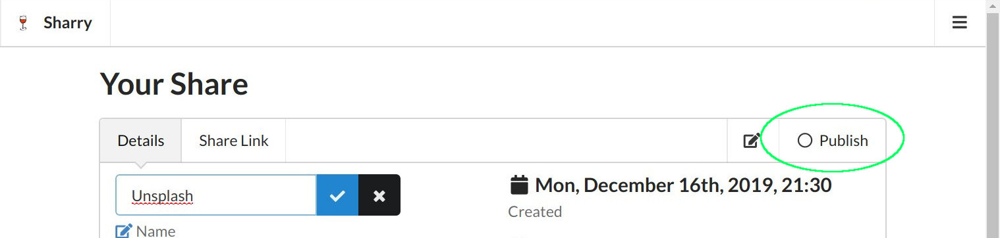
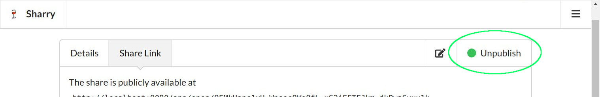
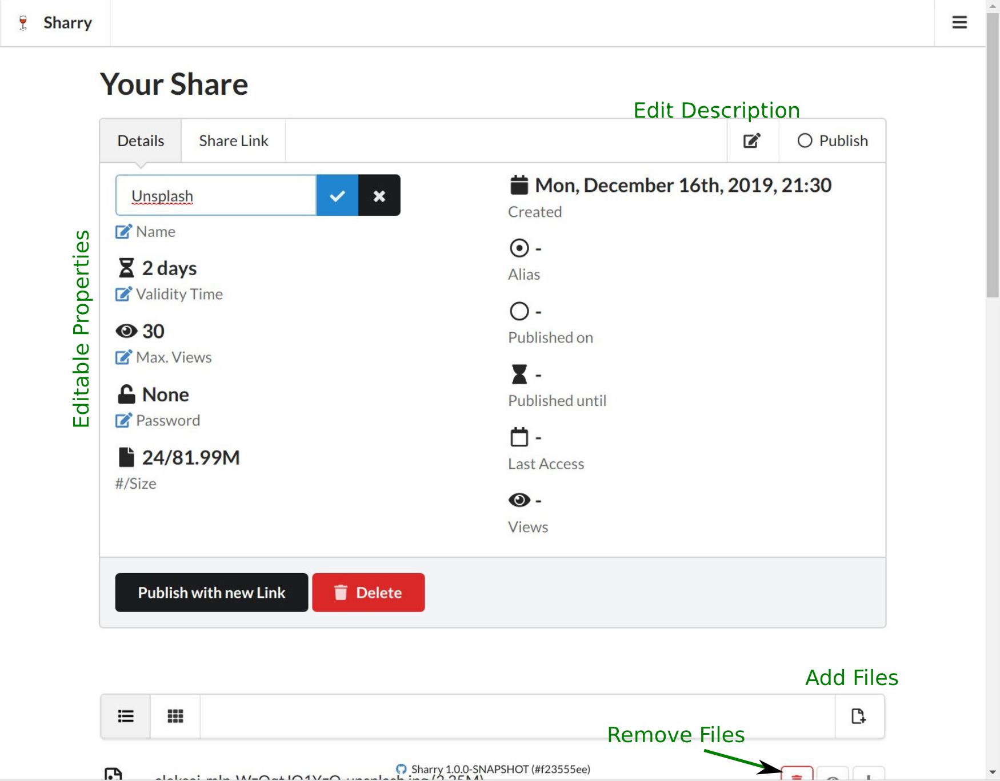

# Webapplication

The web client is written in [Elm](https://elm-lang.org), an awesome
programming language for the web :-). The [tus javascript client
library](https://github.com/tus/tus-js-client) is used to realize the
resumable uploads. All the css is provided by
[Semantic-UI](https://semantic-ui.com/).


## Creating a new share

After logging in, you can create new shares:



The details are all optional and can also be changed afterwards. It is
required to specfiy a description, some files or both. Otherwise
submitting won't work.

The detail options are explained below.

### Name

A share may have a name. This name is mainly meant for the owner to
helps finding shares easier in the list view. The name will also be
used as the head line, if the description doesn't contain a markdown
headline (a line starting with `#`). In that case, users who access
the published site, will see it.


### Description

You can add some text to a share which will be displayed at the
download page. The description can be
[markdown](http://daring-fireball.net) and is converted to HTML when
being displayed.

Furthermore, the description text is processed as a
[mustache](http://mustache.github.io/mustache.5.html) template and
allows to refer to the attached files. You can access the following
properties of any uploaded file:

- `id`
- `filename`
- `url`
- `mimetype`
- `size`
- `length`
- `checksum`

The `size` is the file size as a human readable string, while `length`
is the number in bytes. You can refer to files using their name or
index in the list. When using the file name, all dots in there must be
removed.


```
{{#file.0}}{{url}}{{/file.0}}
```


or


```
{{filename.dsc0100JPG.url}}
```


This makes it possible to embed files in the description, for example
to display an image file, you could write the following description:


```

```


There is also a `files` property that can be used to iterate through
all uploaded files. So this would render the id and url of all files:


```
{{#files}}
- {{id}}: {{url}}
{{/files}}
```


### Validity Time

Every upload has a validity time after which the uploaded files are
“expired”. Then the public download page is not visible anymore and
the files can't be downloaded from non-protected urls.

The files are there and the user that owns them still has access. They
are eventually removed by a cleanup job.


### Password

The files can be further protected by a password. The download page
requires this password in order to download the files.

The idea is that this password is a second secret, next to the url.
You can share the URL using one channel (maybe e-mail) and the
password using another channel. A person must have both things in
order to see the files.


### Maximum Views

This setting restricts the number of accesses to the download page. If
the download page is accessed more than this number, it will not work
anymore.


## Publish / Unpublish / Republish

A share that has not been published can only be accessed by its owner.
In order to create a link for everyone else, click the `Publish`
button in the top right of the detail view of a share.



Once a share is published that circle is green.



The expiry time is calculated from the validity time added to the
point in time the share is publshed. You'll see it in the details
pane.

If the share is published you can get the link clicking on the *Share
Link* pane. You can copy&paste it, scan the QR code or send it via
e-Mail (if sharry is configured for that, it can be sent directly in
the webapp).

You can unpublish a share at any time. The public link will
immediately stop working and the circle will be empty. Then there are
two options for publishing it again: one will generate a new random
link, the other option reuses the current public link. If you hit the
*Publish* button in the top right corner again, the share will be
published anew – meaning the current validity time is added to the
current point in time, but the public link will *not* change. All
people that you have shared it with earlier can immediately open the
site again.

If you rather like to publish it to a new URL, click the black publish
button at the bottom of the *Detail* pane (see the screenshot below).


## Edit Details

The share properties can be changed in the detail view of a share. The
detail view consists of a top menu, then follows the description, then
the file list menu and finally the list of files.

Open the *Detail* tab in the top menu to see all properties.



Properties that have the little blue edit icon in front of their names
can be changed by clicking that icon.

The description can be edited by clicking the edit icon next to the
`Publish` button in the top right corner.

It is also possible to add or remove files of that share. Click the
right menu item of the file list menu and the upload form appears.


## Alias Pages

The alias page is a way to let other users upload files for you. The
idea is the same as with shared downloads: there is a cryptic URL you
can share with others. This url allows to upload files that will be
associated to the owner of that alias page.

Click in the top right menu that opens a drop down menu and choose
*Aliases*. There you can create, edit and remove alias pages.

Alias pages are also convenient for quickly uploading files for
yourself, as they don't require any authentication. For example, using
curl you could do:

```
$ curl -H'Sharry-Alias: E5EohHtJHxN' -F file=@test.jpg -F file=@logo.jpg http://localhost:9090/api/v2/alias/upload
{"success":true,"message":"Share created.","id":"FDQvHK2LVGe-SjkDjQxMiSo-8fPyBqKX3AY-nmWWnDsrRX3"}
```

See the [REST page](rest) for more details on the various routes.
